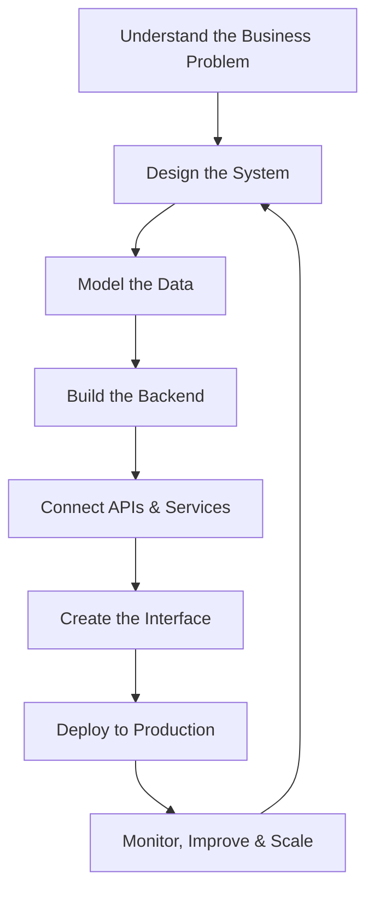

<h1 align="center">Diego NMedina</h1>

<h3 align="center">
  Full-Stack Engineer • Systems Architect • Automation Builder
</h3>

<p align="center">
  I design and build digital systems that turn business complexity into clean, scalable, and reliable software.
</p>

<div align="center">

[](https://diegonmedina.dev)
[](https://www.linkedin.com/in/diego-medina-9aa79920b/)
[](https://dev.to/diegonmedina)

</div>

<div align="center">
  
</div>

<br />

---

## ⚡ The Short Version

I’m a full-stack engineer who builds **business-critical software**: platforms, APIs, dashboards, automation workflows, integrations, and cloud-hosted systems.

My work usually lives at the intersection of:

```txt
Business Problems
      ↓
System Architecture
      ↓
Clean Backend Logic
      ↓
Reliable Infrastructure
      ↓
Useful Products People Actually Use
```

I care about software that is not only functional, but also **maintainable, scalable, fast, and aligned with real business outcomes**.

---

## 🧭 My Engineering Compass

```txt
Build with purpose.
Design for change.
Ship with ownership.
Improve without ego.
Scale with clarity.
```

I believe great engineering is not about adding complexity.
It is about making complex things understandable, reliable, and valuable.

---

## 🧠 What I Actually Do

<table>
  <tr>
    <td width="50%">
      <h3>🏗️ Architect Systems</h3>
      <p>
        I design backend structures, APIs, database models, and workflows that support real-world operations and future growth.
      </p>
    </td>
    <td width="50%">
      <h3>⚙️ Automate Operations</h3>
      <p>
        I transform repetitive business processes into reliable automations, integrations, scheduled jobs, and internal tools.
      </p>
    </td>
  </tr>
  <tr>
    <td width="50%">
      <h3>🚀 Build Products</h3>
      <p>
        I develop full-stack applications from idea to production, including admin panels, customer portals, mobile apps, and dashboards.
      </p>
    </td>
    <td width="50%">
      <h3>🔥 Optimize Performance</h3>
      <p>
        I improve database queries, backend flows, server environments, caching strategies, and user-facing performance.
      </p>
    </td>
  </tr>
</table>

---

## 🧩 Engineering Operating System



Software is never “done”.
It evolves with the business, the users, the data, and the problems it solves.

---

## 🧱 Core Engineering Areas

### Backend & Architecture

* PHP, Laravel, CodeIgniter
* REST APIs and service integrations
* Modular backend architecture
* Authentication and authorization flows
* Queues, jobs, cron tasks, and background processes
* Performance optimization and caching
* Secure and maintainable business logic

### Frontend & Product Interfaces

* React, Next.js, Ionic React
* TypeScript and modern JavaScript
* Admin dashboards and operational panels
* Responsive UI implementation
* API-driven interfaces
* User experience optimization

### Infrastructure & Delivery

* Linux servers
* LAMP and LEMP environments
* DigitalOcean and cloud deployments
* DNS, SSL, domains, and production configuration
* Git workflows and deployment processes
* Environment management and troubleshooting

### Data & Persistence

* MySQL and PostgreSQL
* Relational database design
* Query optimization
* Indexing strategies
* Data modeling for business workflows
* Reporting and operational data structures

---

## 🛠️ Tech Arsenal

<div align="center">

### Languages, Frameworks & Runtime


<br />
<br />

### Databases, Infrastructure & Tools


</div>

---

## 🧪 The Type of Problems I Like Solving

```txt
01. “This process takes too much manual work.”
02. “This platform is getting slow.”
03. “We need to connect this system with another one.”
04. “The business logic is becoming hard to maintain.”
05. “We need a custom dashboard for operations.”
06. “We need to move from idea to production.”
07. “This database needs structure and optimization.”
08. “This app needs to scale without breaking.”
```

These are the problems where I enjoy working the most: messy, real, business-driven technical challenges.

---

## 🚀 Systems I Build

<table>
  <tr>
    <td>
      <strong>Commerce Platforms</strong>
      <br />
      Product catalogs, carts, pricing logic, orders, payments, invoices, and integrations.
    </td>
    <td>
      <strong>Booking & Reservation Systems</strong>
      <br />
      Availability, scheduling, guest flows, payments, notifications, and admin control.
    </td>
  </tr>
  <tr>
    <td>
      <strong>Automation Engines</strong>
      <br />
      Scheduled jobs, API syncs, business workflows, alerts, and operational shortcuts.
    </td>
    <td>
      <strong>Internal Tools</strong>
      <br />
      Admin panels, dashboards, CRM-like workflows, reporting tools, and productivity systems.
    </td>
  </tr>
  <tr>
    <td>
      <strong>API Integrations</strong>
      <br />
      Payment gateways, CRMs, ERPs, communication tools, inventory systems, and custom APIs.
    </td>
    <td>
      <strong>Cloud Applications</strong>
      <br />
      Production-ready apps deployed with proper environments, domains, SSL, and server setup.
    </td>
  </tr>
</table>

---

## 📈 Impact Over Output

I don’t measure engineering only by lines of code.

I care about:

* Fewer manual tasks
* Faster workflows
* Cleaner architecture
* Better user experience
* More reliable deployments
* Easier maintenance
* Stronger business operations
* Systems that keep working after launch

```txt
Code is the tool.
Impact is the goal.
```

---

## 🧠 Engineering Principles

<details>
  <summary><strong>01. Simple is not basic</strong></summary>
  <br />
  The best systems are usually simple on the surface and carefully designed underneath.
</details>

<details>
  <summary><strong>02. Architecture should reduce fear</strong></summary>
  <br />
  A good codebase allows developers to make changes without breaking everything around them.
</details>

<details>
  <summary><strong>03. Business context matters</strong></summary>
  <br />
  Technical decisions should make sense for the product, the team, the users, and the stage of the business.
</details>

<details>
  <summary><strong>04. Performance is a feature</strong></summary>
  <br />
  Speed, reliability, and stability directly affect user trust.
</details>

<details>
  <summary><strong>05. Ownership does not end at deployment</strong></summary>
  <br />
  Real engineering includes monitoring, debugging, improving, documenting, and supporting what you build.
</details>

---

## 🧬 My Developer DNA

```txt
Backend Architecture  ████████████████████  100%
Problem Solving       ████████████████████  100%
API Integrations      ███████████████████░   95%
Database Design       ██████████████████░░   90%
Automation            ██████████████████░░   90%
Frontend Development  ████████████████░░░░   80%
Infrastructure        ████████████████░░░░   80%
Product Thinking      ███████████████████░   95%
```

---

## 🧾 Current Engineering Focus

* Building scalable Laravel-based systems
* Improving API architecture and integrations
* Automating business operations
* Designing cleaner database structures
* Creating better internal tools
* Strengthening DevOps and production workflows
* Writing software that is easier to maintain, debug, and grow

---

## 📊 GitHub Activity

<div align="center">


</div>

<br />

<div align="center">


</div>

---

## 🧭 Beyond the Code

Engineering is the craft.
Problem solving is the mission.
Continuous improvement is the lifestyle.

I like building things that are useful, stable, and meaningful.
Systems that help businesses move faster.
Tools that reduce friction.
Products that feel simple because the complexity was handled with care.

---

## 🌐 Connect With Me

<div align="center">

[](https://diegonmedina.dev)
[](https://www.linkedin.com/in/diego-medina-9aa79920b/)
[](https://dev.to/diegonmedina)
[](https://github.com/DiegoNMedina)

</div>

---

<div align="center">

## “I build systems that solve problems, scale ideas, and make operations smarter.”

<br />

<strong>Diego NMedina</strong> <br />
Full-Stack Engineer • Systems Architect • Builder

</div>
